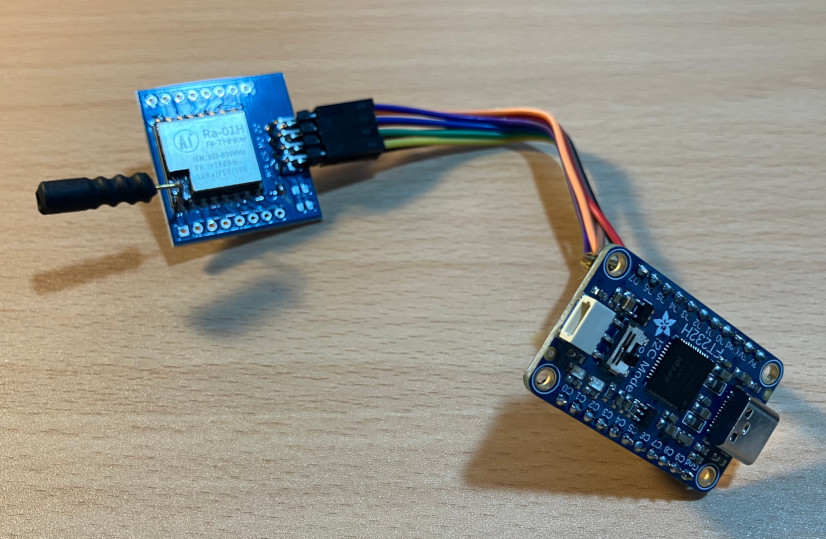

# Hardware
* FT232H + SX127x/SX126x


* Tested with:
    * Ra-01H (SX1276)
    * Ra-01SH (SX1262)

# Initialization
```
pip3 install -r requirements.txt
```

# Run
```
python3 main.py # GUI
python3 main.py --textual # TUI
```